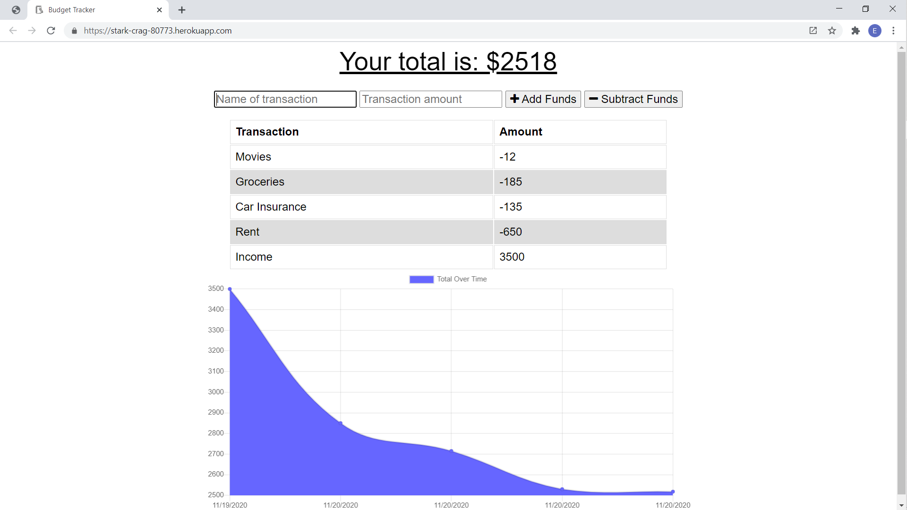
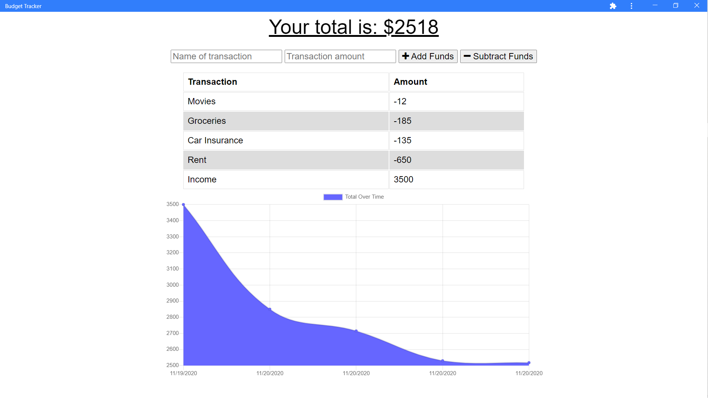

# PWA-Budget Tracker

## Project Description

This is a Progressive Web Application (PWA) that allows for the entering and saving of expenses over time to form a budget. Enter a title/category for the expense, enter an amount, and then choose whether to add or substract the amount. The user's expenses are then displayed graphically.

The app includes a manifest for use as a Progressive Web App on computers or mobile devices. This allows the app to appear as though it was designed to run natively on the device while it is actually running in a browser. There is a service worker that allows for caching of assets to allow for faster loading. Also, IndexedDB is used to save transactions entered while the app is not connected to the internet, so that when it is connected again those transactions are added to the MongoDB database. This allows a seamless user experience when the user is both online or offline.

## Table of Contents

- [Title](#project-title)
- [Description](#project-description)
- [Table of Contents](#table-of-contents)
- [Installation](#installation-instructions)
- [Usage](#usage)
- [Contributing](#guidelines-for-contributing)
- [Tests](#tests)
- [Technologies](#technologies-used)
- [Author](#author)
- [Questions](#questions)
- [License](#license)

## Installation Instructions

Clone this repository and type "npm run start" in the command line. Then access the app at http://localhost:18672. Or, use [the PWA Budget Tracker](https://stark-crag-80773.herokuapp.com/) as deployed on Heroku.

## Usage

See the description above. The [PWA Budget Tracker](https://stark-crag-80773.herokuapp.com/) is deployed on Heroku.

### Webpack

This app uses the [Webpack](https://www.npmjs.com/package/webpack) package for Node.js as a module bundler. Webpack takes a large number of files and generates a single file (also called a bundle) to run the app. The bundle is a minified file that eliminates whitespace and increases performance.

##### **Webpack Plug-ins**

- [webpack-pwa-manifest](https://www.npmjs.com/package/webpack-pwa-manifest) is a plugin that generates a "manifest.json" for Progressive Web Apps. The module has auto icon resizing and fingerprinting support. The manifest is a JSON file that tells the browser about the Progressive Web App and how it should behave when installed on the user's desktop or mobile device. Typically, a manifest file will contain:

  - app name
  - icons the app should use
  - url that should be opened when the app is launched.

- [workbox-webpack-plugin](https://www.npmjs.com/package/workbox-webpack-plugin) using the portion that generates a complete service worker. A service worker is a script that the browser runs in the background, separate from the web page, allowing for features that do not need a web page or user interaction.

Together, the manifest and the service worker allow the [PWA Budget Tracker](https://stark-crag-80773.herokuapp.com/) to become a Progressive Web App:

[Webpack](https://www.npmjs.com/package/webpack); [webpack-pwa-manifest](https://www.npmjs.com/package/webpack-pwa-manifest); and [workbox-webpack-plugin](https://www.npmjs.com/package/workbox-webpack-plugin) configurations are found in the _webpack.config.js_ file.

### IndexedDB

The IndexedDB is a low-level API for client-side storage of structured data. The app uses this API to store transactions that are entered while the user is offline. When the user goes back online the transactions stored in IndexedDB are put into the MongoDB database. This allows for a seamless user experience in both online and offline modes.

## Guidelines for Contributing

For feature suggestions or to make any other contributions to the [PWA Budget Tracker](https://dashboard.heroku.com/apps/stark-crag-80773/settings), please e-mail Eric D. Torres at the e-mail address provided below.

## Tests

Test early; test often.

### Technologies Used

### :computer: :computer: :computer: :computer: :computer: :computer:

#### :memo: HTML5 :memo:

**HTML5** is a markup language used for structuring and presenting content on the World Wide Web. The goals are to improve the language with support for the latest multi-media and other new features; to keep the language both easily readable by humans and consistently understood by computers and devices; and to remain backward compatible to older software. Many new symantec features are included.

_HTML5_ content borrowed from <a target="_blank" rel="noopener noreferrer">[this page](https://en.wikipedia.org/wiki/HTML5).</a>

#### :art: CSS :art:

**Cascading Style Sheets (CSS)** is a stylesheet language used for describing the presentation of a document written in a markup language (such as HTML5). CSS is designed to enable the separation of presentation and content; including layout, colors, and fonts. This separation improves content accessibility to provide more flexibility and control in the specification of presentation characteristics, enabling multiple web pages to share formatting by specifying relevant CSS in a separate file, which reduces complexity and repetition in the structural content (HTML), as well as enabling the file to be cached to improve the page load speed between the pages that share the file and its formatting.

Separation of formatting and content also makes it feasible to present the same markup page in different styles for different rendering methods, such as on-screen, in print, by voice, and on Braille-based tactile devices.

_CSS_ content borrowed from <a target="_blank" rel="noopener noreferrer">[this page](https://en.wikipedia.org/wiki/Cascading_Style_Sheets).</a>

#### :shoe: Bootstrap 4 :shoe:

**Bootstrap 4** is a free and open-source CSS framework directed at responsive, mobile-first front-end web development. It contains CSS and (optionally) JavaScript-based design templates for typography, forms, buttons, navigation, and other interface components.

_Bootstrap 4_ content borrowed from <a target="_blank" rel="noopener noreferrer">[this page](https://en.wikipedia.org/wiki/Bootstrap\_(front-end_framework)).</a>

#### :sparkler: JavaScript :sparkler:

**JavaScript (JS)** is one of the core technologies of the World Wide Web (along with HTML and CSS). It enables interactive web pages and is an essential part of web applications. JS is a multi-faceted, scripting language that provides versatility through Application Programming Interfaces (APIs) and Document Object Model (DOM) manipulation, among others.

_JavaScript_ content borrowed from <a target="_blank" rel="noopener noreferrer">[this page](https://en.wikipedia.org/wiki/JavaScript).</a>

#### :chart_with_upwards_trend: Chart.js :chart_with_upwards_trend:

**Chart.js** is a free and open source JavaScript library that makes data visualization fun and easy. Use the library in conjunction with the HTML5 canvas tag to quickly add data visualization to your JavaScript projects.

Find out more about _Chart.js_ at <a target="_blank" rel="noopener noreferrer">[this page](https://www.chartjs.org/docs/latest/).

#### :globe_with_meridians: NODE.js :globe_with_meridians:

**NODE.js** is an open-source, cross-platform JavaScript runtime environment that execute JavaScript code outside a web browser. NODE.js lets developers use JavaScript to write command line tools and for server-side scripting. NODE.js represents a "Javascript everywhere" paradigm, unifying web-application development around a single programming language, rather than different programming languages for server- and client-side scripts.

_NODE.js_ content borrowed from <a target="_blank" rel="noopener noreferrer">[this page](https://en.wikipedia.org/wiki/Node.js).</a>

[Download Node.js](https://nodejs.org/en/).

#### :satellite: Express.js :satellite:

**Express.js** is a minimal and flexible NODE.js web application framework that provides a robust set of features for web and mobile applications. The myriad HTTP utility methods and middleware allow for the creation of a robust API. Express.js provides a thin layer of fundamental features, without obscuring NODE.js features.

_Express.js_ content borrowed from <a target="_blank" rel="noopener noreferrer">[this page](https://expressjs.com/).</a>

#### :japanese_ogre: MongoDB :japanese_ogre:

**MongoDB** is a document-oriented NoSQL database used for high volume data storage. Instead of using tables and rows like traditional databases, MongoDB makes use of collections and documents. Documents consist of key-value pairs that are the basic unit of data and more closely resemble the JSON architecture.

_MongoDB_ content borrowed from <a target="_blank" rel="noopener noreferrer">[this page](https://www.guru99.com/what-is-mongodb.html#:~:text=MongoDB%20is%20a%20document%2Doriented,use%20of%20collections%20and%20documents.&text=Collections%20contain%20sets%20of%20documents,equivalent%20of%20relational%20database%20tables)</a>

#### :school_satchel: Webpack :school_satchel:

**Webpack** is a static module bundler for modern JavaScript applications. When webpack process an application, it internally builds a dependency graph that maps every module the project needs and generates one or more bundles, which enables JavaScript to have greater modularization.

_Webpack_ content borrowed from <a target="_blank" rel="noopener noreferrer">[this page](https://webpack.js.org/concepts/)</a>

#### :card_index: IndexedDB :card_index:

**IndexedDB** is a way for developers to persistently store data inside a user's browser. Because it lets you create web applications with rich query abilities regardless of network availability, your applications can work both online and offline.

_IndexedDB_ content borrowed from <a target="_blank" rel="noopener noreferrer">[this page](https://developer.mozilla.org/en-US/docs/Web/API/IndexedDB_API/Using_IndexedDB)</a>

### Author

This _PWA-Budget Tracker_ was built by :green_heart: Eric D. Torres :green_heart:

## Questions

Check out my [GitHub profile](https://github.com/etorres-revature).

You can contact me by e-mail at etorresnotary@gmail.com for any additional questions and/ or clarifications you may need about the project.

##### License

[This application uses the **MIT License** found here](./LICENSE).

**[This README.md file generated with my NODE.js README Generator app.](https://github.com/etorres-revature/NODEjs_README.md_Generator)**
